## CI/CD with Self-hosted Gitlab and Docker
I recently set up a self-managed GitLab instance with a GitLab Runner and a CI/CD pipeline using a shell executor and Docker. GitLab is a web-based Git repository manager that provides powerful collaboration features for version control, code review, continuous integration and deployment. Setting up these tools required some research and trial and error, but I was able to successfully get everything up and running. In this guide, I'll walk you through the steps I took to set up my GitLab instance and CI/CD pipeline using a shell executor and Docker.

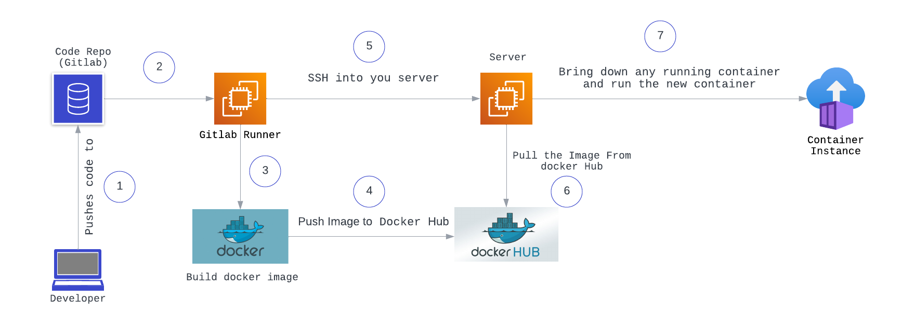

## **Pre-Requisites**

- 1 machine for Gitlab Server, ubuntu 16.04+, 2 CPUs, 4 GB RAM, 10 GB storage
- 1 machine for Gitlab Runner, ubuntu 16.04+, 1 CPU, 2 GB RAM, 10 GB storage
- 1 machine for Application server, ubuntu 16.04+, 1 CPU, 2 GB RAM, 10 GB storage

## **Setting up the Gitlab server**

To install GitLab on an Ubuntu server, you can use the official GitLab omnibus package. This package provides a complete installation of GitLab, including all the necessary dependencies and components. Once installed, you can configure GitLab to meet your specific needs, such as setting up user authentication, defining project repositories, and configuring CI/CD pipelines.

### **Step 1: Installing the necessary dependencies**

Login to the gitlab server machine with the sudo privilege:

```
sudo apt-get update
sudo apt-get install -y curl openssh-server ca-certificates tzdata perl
```

You can install and setup postfix or sendmail for sending email notifications by using the command:

```
sudo apt-get install -y postfix
```

While installing Postfix, a configuration screen may pop up. Choose the 'Internet Site' option and hit the enter key. Provide your server's external DNS as 'mail name' and hit enter. If any further screens come up, simply keep pressing enter to accept the default options.

I am skipping the postfix installation step for now as it's not the main focus of this article.

### **Step 2: Adding and Installing the Gitlab package repository**

```
curl https://packages.gitlab.com/install/repositories/gitlab/gitlab-ce/script.deb.sh | sudo bash
```

💡 I am using the community edition of gitlab

If you want to set up DNS for your GitLab server, ensure that your DNS settings are correct. Replace "**[https://gitlab.example.com](https://gitlab.example.com/)**" in the command below with the URL you want to use to access your GitLab instance. The installation process will set up and launch GitLab at that URL automatically. Alternatively you can also use the IP address of your server.

```
sudo EXTERNAL_URL="http://<HOST-NAME OR IP>" apt-get install gitlab-ce
```

When using https:// URLs, GitLab will automatically ask for a certificate using Let's Encrypt. This process requires a valid hostname and inbound HTTP access. Alternatively, you have the option to use your own certificate, or you can choose to use http:// (without the s) instead.

### **Step 3: Signing in**

Navigate to the hostname or IP address of your server where the GitLab login screen should appear.


The default username for root user is **`root`**
 and if you didn't set up a password during installation a random password will be generated at **`/etc/gitlab/initial_root_password`**
. Sign in to see the following interface:

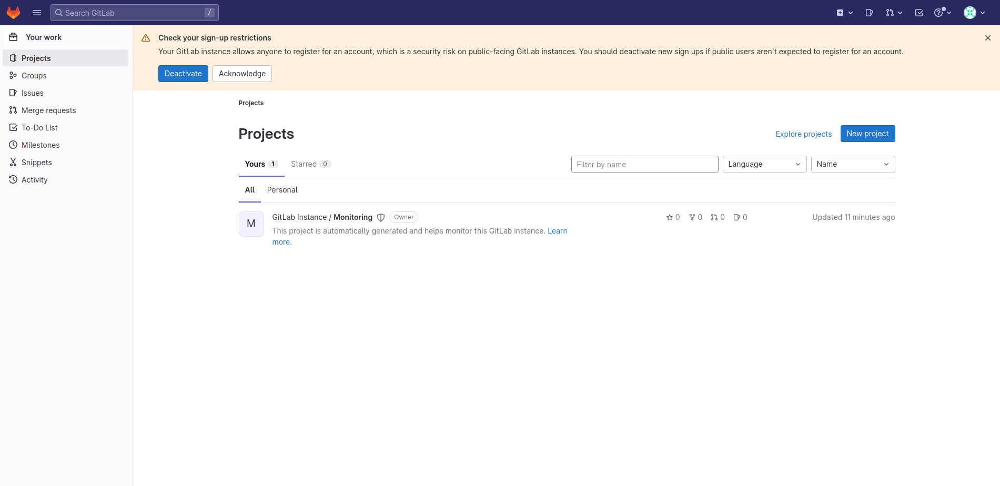

## **Setting up the Gitlab runner**

GitLab Runners are agents that can execute GitLab CI/CD (Continuous Integration/Continuous Deployment) pipelines. They are responsible for running the jobs defined in the **`.gitlab-ci.yml`** file that is located in the root directory of your GitLab project. The runners can be installed on your local machine, on a server, or in the cloud, and can be configured to run pipelines for a specific project or across all projects in a GitLab instance.

### **Step 1: Adding the Gitlab runner repository and Installing the runner**

```
sudo apt-get update
curl -L https://packages.gitlab.com/install/repositories/runner/gitlab-runner/script.deb.sh | sudo bash
sudo apt-get install gitlab-runner
```

### **Step 2: Generating a token in Gitlab**

1. From the dashboard, in the top left corner, select  **"Admin"**.

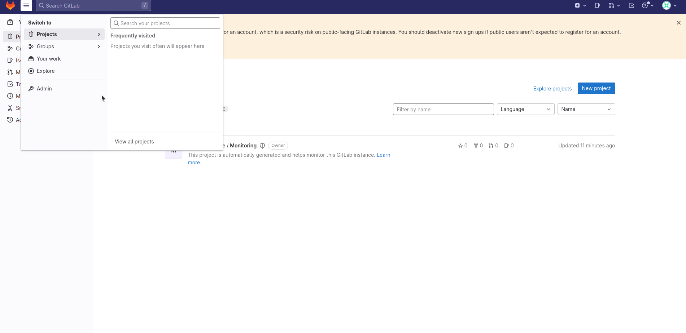

1. In the admin area on the left, go to **"CICD > Runners"**.

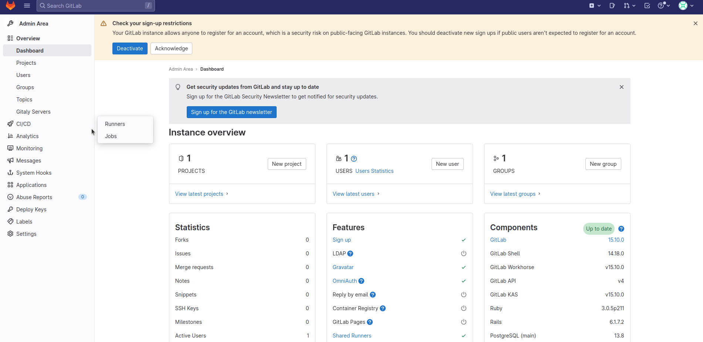

1. Click on **"Register an instance runner"** and copy this token.

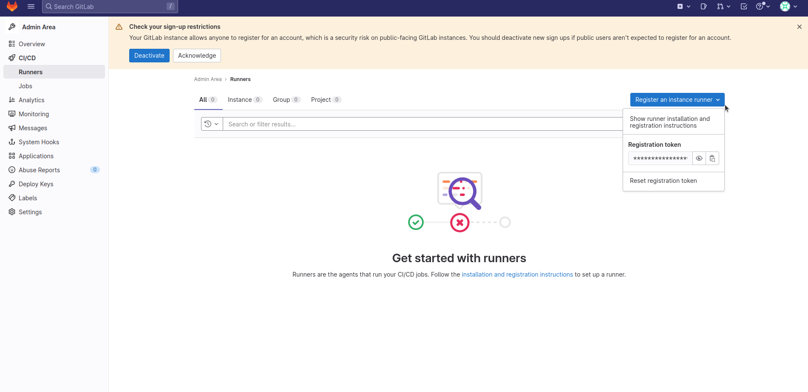

### **Step 3: Registering the runner**

1. Go back to the runner configuration and run the following command. On prompt, paste the copied token.

```
sudo gitlab-runner register
```

1. The registration process will prompt you to enter your GitLab URL (hostname or IP of GitLab server), registration token, and other details. Follow the prompts to complete the registration.
Note: Select the shell executor for this tutorial. You can choose different executors for different scenarios.

### **Step 4: Installing Docker and Generating and Installing an SSH key pair**

In order to containerize your application, your runner would need a container runtime (docker in this case). Install docker using the following commands:

```
sudo apt-get update
sudo apt-get install docker.io
```

💡 We will be using the shell executor, where running commands with the **`sudo`** privilege is not possible, and docker commands need to be run as the **`sudo`** user. Therefore we will use this command to allow the **`gitlab-runner`** user to use the docker commands without the **`sudo`** privilege:

```
sudo usermod -aG docker gitlab-runner
```

Restart the runner:

```
sudo systemctl restart gitlab-runner
```

Now, log in as the **`gitlab-runner`** user and navigate to the **`~/.ssh`** directory:

```
sudo -su gitlab-runner
cd ~/.ssh
```

Generate an SSH key pair:

```
ssh-keygen -t rsa -b 4096
```

Now, change the permissions of the private key to **`600`** for security reasons. Note that you have to keep this private key safe and secure.

```
chmod 600 ~/.ssh/id_rsa
```

Copy the corresponding public key and copy it somewhere for now.
```
cat ~/.ssh/id_rsa.pub
```

# **Setting up the Application server**

This application server will run your app and be accessible to end-users.

1. Login to the application server machine with sudo privileges.
2. Install Docker since the runner needs to run Docker commands on this machine as well.

```
sudo apt-get update
sudo apt-get install docker.io
```

1. To avoid using **`sudo`** with Docker commands, run the following command:

```
usermod -aG docker ubuntu
```

1. Set up the public key.

Navigate to the following:

```
nano ~/.ssh/authorized_keys
```

💡 If you don't have this file, you will need to create it manually.

Paste the public key you copied earlier in this file. This will allow the runner to easily SSH into the server.

## **Setting up the Project Directory**

### **Step 1: Creating a new Gitlab project**

1. From the dashboard, navigate to **`Projects`** > **`View all projects`**.

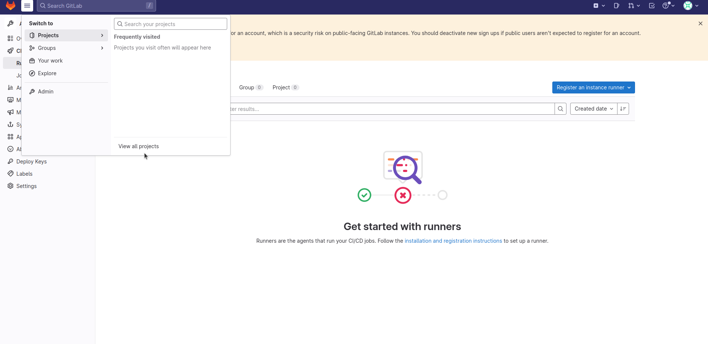

1. Click on **`New Project`** > **`Create blank project`**, and fill in the necessary details.

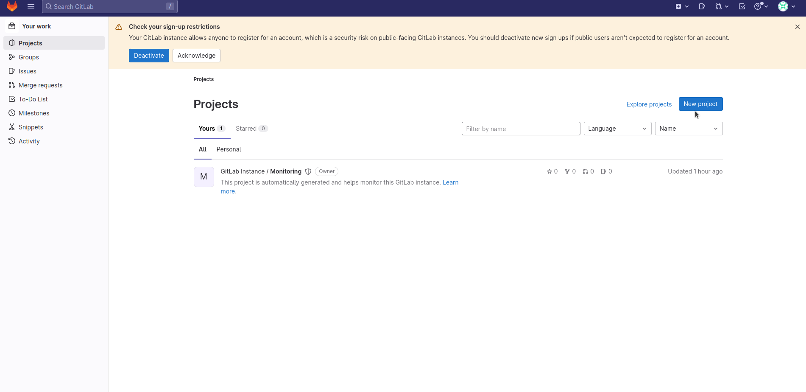


💡 Ensure that the project is made public.

### **Step 2: Setting up the necessary environment variables**

Your **`.gitlab-ci.yml`** file will require your Docker Hub credentials. To maintain security, assign the credentials to environmental variables and use the variable names in the files instead. Please note that these variables can only be seen by administrative users.

1. From the project page, go to **`Settings`** > **`CI/CD`**.

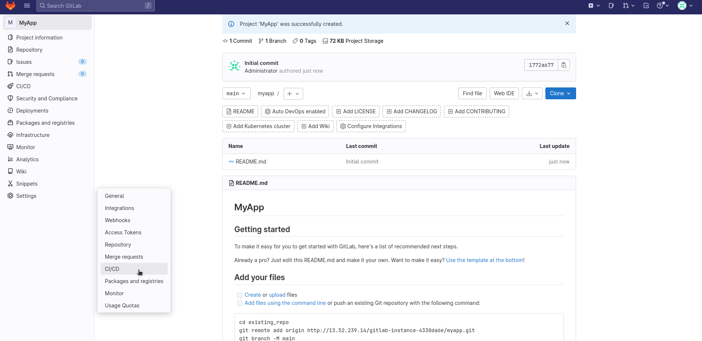

1. Scroll down to the variable section and click on **`Expand`** > **`Add variable`**.

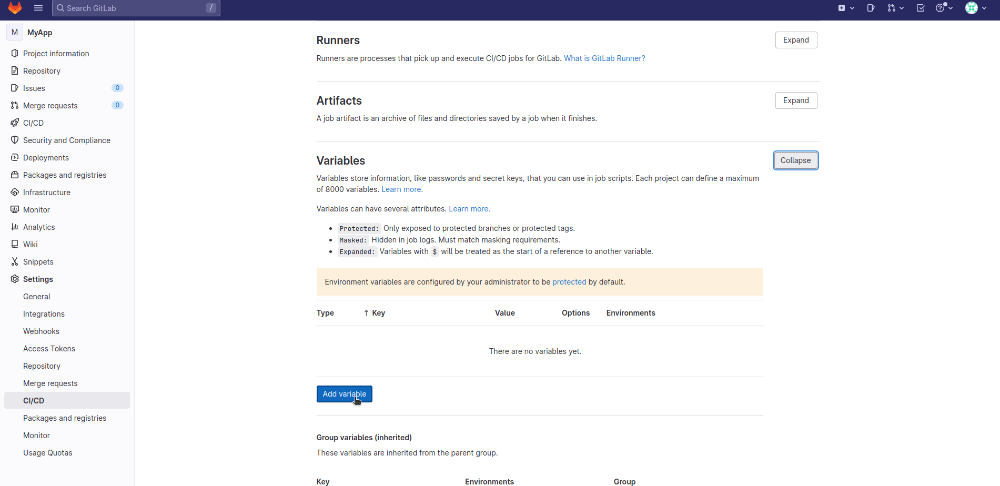
1. Add the name of this variable and its value. Ensure to uncheck the **`Protect variable`** option, as enabling this option will make your variables accessible only in the protected main branch.Click on **`Add variable`**.

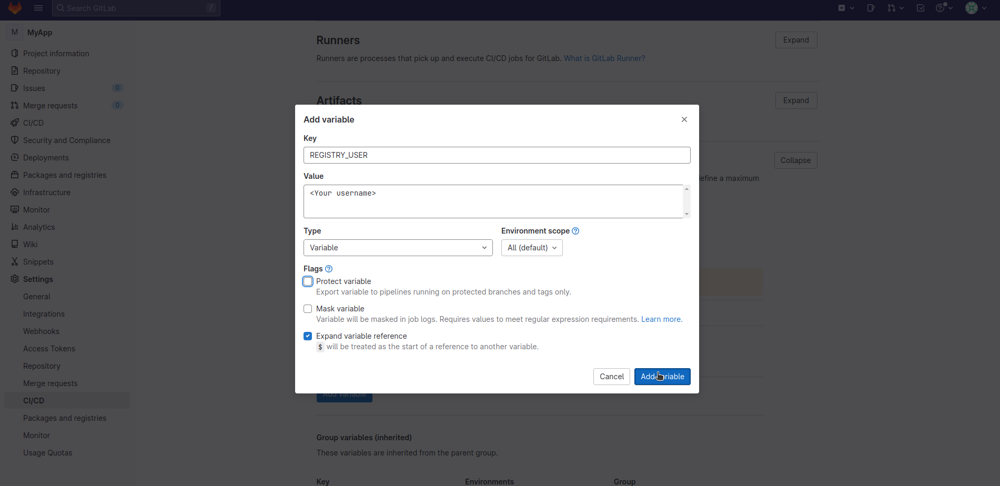
Repeat the same steps to add the registry password variable named as **`REGISTRY_PASS`**.Ensure to uncheck the **`Protect variable`** option and check the **`Mask variable`** option.

## **Creating the Dockerfile and .gitlab-ci.yml file**

For this example, I am using a Next.js web app. Along with the project files and folders, you will need to add the following two files:

1. Dockerfile
2. .gitlab-ci.yml

### **Contents of the Dockerfile**

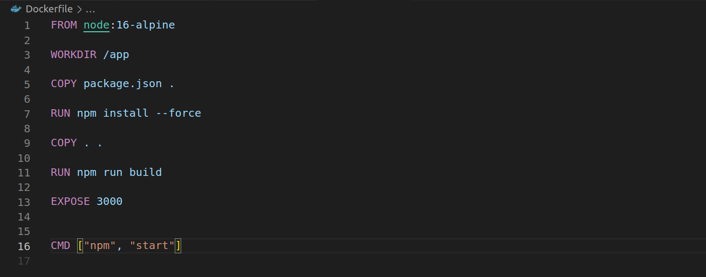
### **Contents of the .gitlab-ci.yml file**

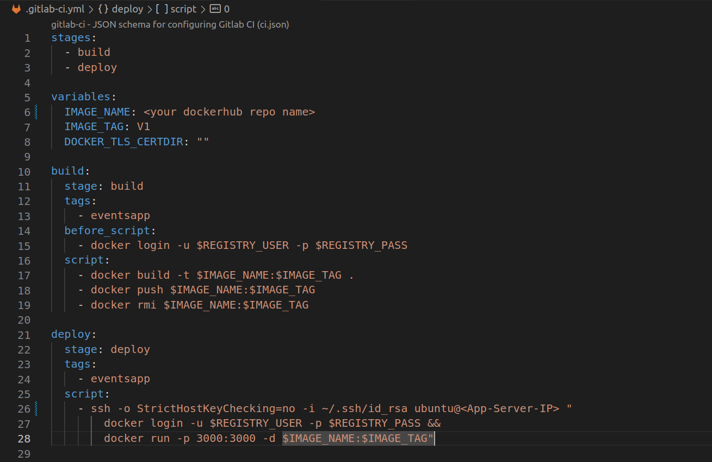
💡 If there are no containers running on your application server from before, this is how the .gitlab-ci.yml file should look like. Ensure to replace **`<your dockerhub repo name>`** and **`<App-server-IP>`** with the actual repo name and IP address of the application server.

Run the following commands in this directory to push the code on GitLab:

```
git remote add origin http://<Gitlab-server Hostname or ip>/gitlab-instance-4330da6e/myapp.git
```

Note: Change this command according to your project.

```
git checkout -b develop
git push -uf origin develop
```

As soon as you push the code, the pipeline will get triggered, and the runner will start executing the .gitlab-ci.yml file. You can check the status of the pipeline and see if any errors occur, which breaks the pipeline.

Note: For all subsequent updates and pushes, you need to tweak your file a bit to bring down the already running container and old image and bring up the new container based on the new image.

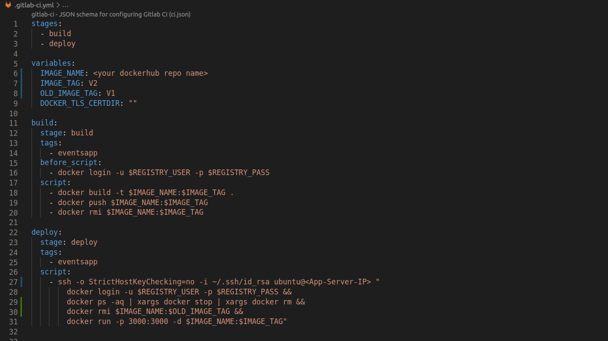
Ensure to edit the **`IMAGE_TAG`** and **`OLD_IMAGE_TAG`** with every push
